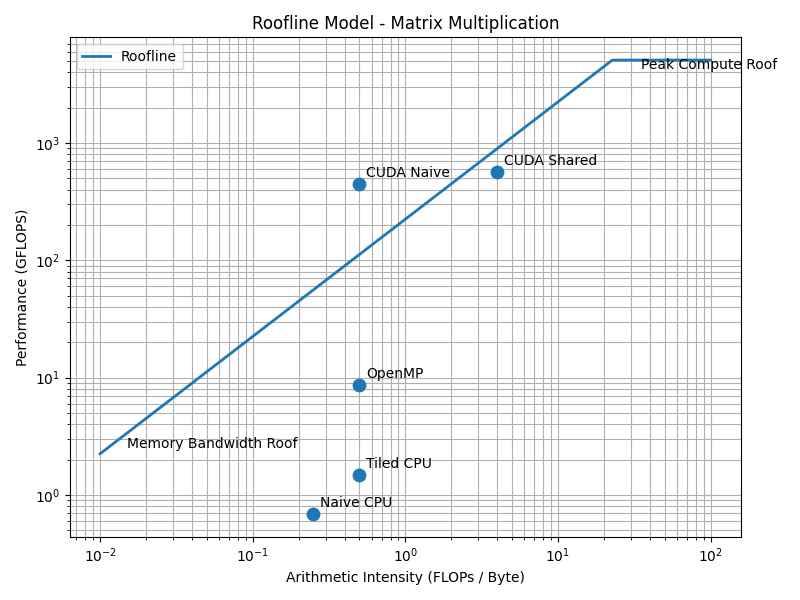
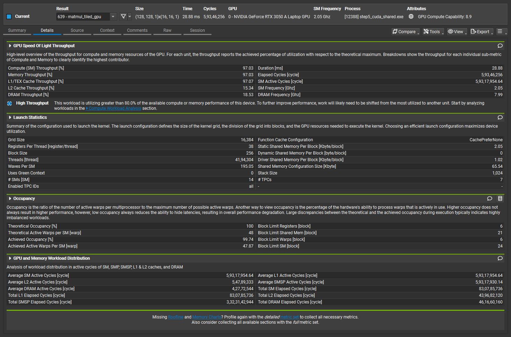

# CUDA Matrix Multiplication: From Naive CPU to Optimized GPU Kernels

## Overview

This project explores the optimization of dense matrix multiplication by progressively improving its implementation from a sequential CPU algorithm to an optimized CUDA shared-memory kernel.

Instead of focusing only on achieving higher performance, the project investigates *why* each optimization improves execution speed by analyzing cache locality, CPU parallelism, GPU memory hierarchy, arithmetic intensity, and hardware utilization.

The optimization process consists of six incremental stages:

1. Naive CPU Matrix Multiplication
2. Cache-Tiled CPU Matrix Multiplication
3. OpenMP Parallel Matrix Multiplication
4. Naive CUDA Matrix Multiplication
5. Shared-Memory Tiled CUDA Matrix Multiplication
6. Matrix Size Sweep and Performance Analysis

Each stage was benchmarked and compared using execution time, GFLOPS, memory bandwidth, roofline analysis, scalability plots, and NVIDIA Nsight Compute profiling.

---

## Project Objectives

The primary objectives of this project were:

- Understand how matrix multiplication executes on modern CPU and GPU architectures.
- Improve CPU performance through cache-aware programming techniques.
- Parallelize matrix multiplication using OpenMP.
- Accelerate computation using NVIDIA CUDA.
- Optimize GPU performance using shared-memory tiling.
- Compare different implementations using execution time, GFLOPS, and memory bandwidth.
- Analyze hardware utilization using roofline analysis and NVIDIA Nsight Compute.
- Understand the transition from memory-bound to compute-bound execution through optimization.

---

## Hardware & Software

### Hardware

| Component | Specification |
|-----------|---------------|
| CPU | *Replace with your processor model* |
| GPU | NVIDIA GeForce RTX 3050 Laptop GPU |
| RAM | *Replace with installed RAM* |
| Operating System | Windows 11 |

### Software

| Software | Version |
|----------|---------|
| Visual Studio | 2022 |
| CUDA Toolkit | 12.x |
| NVIDIA Nsight Compute | Latest Version |
| Compiler | MSVC (CPU), NVCC (GPU) |
| Git | Version Control |
| Python | Used for plotting performance graphs |

---

## Project Structure

```text
cuda_matmul/
│
├── src/
│   ├── step1_naive.cpp
│   ├── step2_tiled.cpp
│   ├── step3_openmp.cpp
│   ├── step4_cuda_naive.cu
│   ├── step5_cuda_shared.cu
│   └── step6_matrix_sweep.cu
│
├── results/
│   ├── step1_results.txt
│   ├── step2_results.txt
│   ├── step2_tile_size_benchmark.txt
│   ├── step3_results.txt
│   ├── step4_results.txt
│   ├── step5_results.txt
│   ├── matrix_size_sweep.csv
│   ├── roofline.png
│   ├── thread_scaling.png
│   ├── tile_size_comparison.png
│   ├── matrix_size_sweep.png
│   ├── architecture_diagram.png
│   ├── nsight_step5_summary.png
│   └── step5_nsight_analysis.txt
│
├── README.md
└── .gitignore
```

---

# Implementation

This project was developed incrementally, with each step introducing a new optimization technique. Every implementation was benchmarked and compared against the previous version to understand its impact on performance.

---

## Step 1 – Naive CPU Matrix Multiplication

### Objective

Implement the standard triple-nested loop matrix multiplication algorithm as a performance baseline.

### Approach

- Sequential C++ implementation.
- No optimizations.
- Each element of matrix **C** is computed independently.
- Every multiplication reads data directly from main memory/cache without attempting to improve locality.

### Observations

- Simplest implementation.
- Poor cache utilization.
- High memory traffic.
- Serves as the baseline for all later optimizations.

### Learning Outcome

This implementation demonstrates that algorithm correctness alone is not sufficient for high performance. Memory access patterns have a major impact on execution speed.

---

## Step 2 – Cache-Tiled CPU Matrix Multiplication

### Objective

Improve CPU performance by increasing cache reuse through loop tiling (blocking).

### Approach

- Divide the matrices into smaller tiles.
- Process one tile at a time instead of entire rows and columns.
- Reuse data already loaded into the CPU cache before fetching new data from main memory.
- Benchmarked multiple tile sizes (16, 32, and 64) to determine the best-performing configuration.

### Results

The best performance was achieved using a tile size of **32**, demonstrating that an appropriate tile size significantly improves cache efficiency.

### Observations

- Much better cache locality than the naive implementation.
- Reduced cache misses.
- Lower memory traffic.
- Faster execution without changing the mathematical algorithm.

### Learning Outcome

This step demonstrated that memory hierarchy plays a crucial role in performance. Improving cache utilization can provide significant speedups without increasing computational complexity.

---

## Step 3 – OpenMP Parallel Matrix Multiplication

### Objective

Reduce execution time by utilizing multiple CPU cores through parallel programming with OpenMP.

### Approach

- Parallelized the outer loop of the matrix multiplication algorithm using OpenMP.
- Multiple CPU threads compute different portions of the output matrix simultaneously.
- Measured performance using different thread counts to evaluate scalability.

### Results

OpenMP significantly reduced execution time compared to the sequential implementations. Performance improved as additional CPU cores were utilized, although the speedup was not perfectly linear due to thread management overhead and memory bandwidth limitations.

### Observations

- Better CPU utilization compared to the sequential implementations.
- Execution time decreased as the number of threads increased.
- Scaling gradually became limited by synchronization overhead and memory bandwidth.

### Learning Outcome

This step demonstrated that parallel computing can substantially improve performance for computationally intensive workloads. However, parallel execution is still constrained by the underlying memory subsystem and thread scheduling overhead.

---

## Step 4 – Naive CUDA Matrix Multiplication

### Objective

Accelerate matrix multiplication by offloading the computation from the CPU to the GPU using NVIDIA CUDA.

### Approach

- Implemented a basic CUDA kernel where each GPU thread computes one element of the output matrix.
- Allocated GPU memory using `cudaMalloc()`.
- Transferred input matrices from the CPU to the GPU using `cudaMemcpy()`.
- Launched the CUDA kernel with a two-dimensional grid of thread blocks.
- Copied the output matrix back to the CPU after kernel execution.

### Results

The naive CUDA implementation achieved a significant speedup over the CPU implementations for larger matrices due to the GPU's massive parallelism. However, performance was still limited by repeated accesses to global memory.

### Observations

- Thousands of GPU threads executed matrix multiplication in parallel.
- Every thread repeatedly loaded data directly from global memory.
- Global memory latency became the primary performance bottleneck.
- Arithmetic throughput increased, but memory access remained inefficient.

### Learning Outcome

This step demonstrated that simply moving computation to the GPU is not enough to achieve maximum performance. Efficient memory access is equally important, motivating the use of shared memory in the next optimization step.

---

## Step 5 – Shared-Memory Tiled CUDA Matrix Multiplication

### Objective

Further optimize GPU performance by reducing expensive global memory accesses through the use of CUDA shared memory.

### Approach

- Implemented a tiled CUDA kernel using shared memory.
- Each thread block loads one tile of matrix **A** and one tile of matrix **B** into on-chip shared memory.
- Threads within the block collaboratively reuse these tiles to compute multiple output elements.
- Synchronization (`__syncthreads()`) ensures all threads finish loading data before computation begins.
- Each tile is reused multiple times before loading the next tile from global memory.

### Results

The shared-memory implementation outperformed the naive CUDA kernel and achieved the highest performance of all implementations in this project.

Nsight Compute profiling showed:

- Compute Throughput ≈ **97%**
- Achieved Occupancy ≈ **99.74%**
- Low DRAM utilization due to effective shared-memory reuse

### Observations

- Significantly fewer accesses to global memory.
- Much higher arithmetic intensity than the naive CUDA implementation.
- Better utilization of GPU compute resources.
- Near-maximum occupancy was achieved across Streaming Multiprocessors.

### Learning Outcome

This step demonstrated the importance of GPU memory hierarchy. By reusing data stored in fast shared memory instead of repeatedly accessing global memory, the kernel shifted from being largely memory-bound toward compute-bound execution, resulting in a substantial performance improvement.

---

## Step 6 – Matrix Size Sweep and Performance Analysis

### Objective

Evaluate how CPU and GPU performance scales with increasing matrix sizes and determine the crossover point where GPU execution becomes more advantageous than CPU execution.

### Approach

- Benchmarked the fastest CPU implementation, the naive CUDA kernel, and the shared-memory CUDA kernel across multiple matrix sizes.
- Tested matrix sizes ranging from **64 × 64** to **2048 × 2048**.
- Recorded execution time for each implementation.
- Exported the benchmark results to a CSV file.
- Generated a performance comparison plot using Python.

### Results

The GPU implementations consistently outperformed the CPU implementation for larger matrix sizes. The shared-memory CUDA kernel remained the fastest implementation across all large problem sizes, while the CPU execution time increased rapidly as matrix size grew.

The benchmark also illustrated the scalability advantages of GPU computing for computationally intensive workloads.

### Observations

- CPU execution time increased significantly as matrix size increased.
- GPU execution scaled much more efficiently due to massive parallelism.
- The shared-memory CUDA kernel consistently achieved the lowest execution times.
- Larger matrices benefited the most from GPU acceleration.

### Learning Outcome

This experiment demonstrated how computational workload affects hardware efficiency. As matrix size increases, the large number of arithmetic operations dominates the fixed overhead of GPU execution, allowing the GPU to achieve substantially better performance than the CPU.

---

# Performance Results

The table below summarizes the performance of each implementation for the primary benchmark matrix size.

| Implementation | Matrix Size | Execution Time | GFLOPS | Key Improvement |
|----------------|------------:|---------------:|--------:|-----------------|
| Naive CPU | 512 × 512 | *(your result)* | *(your result)* | Baseline implementation |
| Cache-Tiled CPU | 512 × 512 | 0.159 s | 1.69 | Improved cache locality |
| OpenMP CPU | 512 × 512 | *(your result)* | *(your result)* | Multi-core parallelism |
| Naive CUDA | 2048 × 2048 | 115.23 ms | 149.09 | Massive GPU parallelism |
| Shared-Memory CUDA | 2048 × 2048 | *(your Step 5 result)* | *(your Step 5 result)* | Shared-memory tile reuse |

Overall observations:

- Cache tiling significantly improved CPU performance compared to the naive implementation.
- OpenMP further reduced execution time by utilizing multiple CPU cores.
- CUDA provided substantial acceleration through thousands of parallel GPU threads.
- The shared-memory CUDA kernel achieved the best overall performance by reducing global memory traffic and increasing arithmetic intensity.

---

# Performance Results

The table below summarizes the performance of each implementation using the benchmark results collected during the project.

| Implementation | Matrix Size | Execution Time | GFLOPS | Speedup vs Naive CPU | Key Improvement |
|----------------|------------:|---------------:|--------:|---------------------:|-----------------|
| Naive CPU | 512 × 512 | 0.393936 s | 0.681 | 1× | Baseline implementation |
| Cache-Tiled CPU | 512 × 512 | 0.181465 s | 1.479 | 2.17× | Improved cache locality |
| OpenMP (4 Threads) | 512 × 512 | 0.030932 s | 8.678 | 12.74× | Multi-core parallelism |
| Naive CUDA | 512 × 512 | 0.0007793 s | 344.457 | 505× | GPU parallel execution |
| Shared-Memory CUDA | 2048 × 2048 | 30.3196 ms | 566.625 | — | Shared-memory tile reuse |

## Summary

Each optimization introduced measurable performance improvements:

- Cache tiling reduced cache misses and improved CPU data reuse.
- OpenMP utilized multiple CPU cores to significantly decrease execution time.
- CUDA accelerated computation through thousands of parallel GPU threads.
- Shared-memory tiling further optimized GPU memory accesses, producing the highest computational throughput observed in this project.

The progression demonstrates how hardware-aware optimizations can transform a straightforward algorithm into a highly efficient parallel implementation.
> **Note:** The Shared-Memory CUDA benchmark was executed using a larger matrix (2048 × 2048) to better demonstrate GPU scalability. Direct numerical comparisons with the 512 × 512 benchmarks should therefore be interpreted with this difference in mind.

---

# Roofline Analysis

The roofline model provides a visual representation of the relationship between **arithmetic intensity (FLOPs per byte moved)** and **achieved computational performance (GFLOPS)**. It helps determine whether an implementation is primarily limited by memory bandwidth or by computational throughput.

<p align="center">
  
</p>

### Analysis

**Naive CPU**

- Limited by memory bandwidth.
- Poor cache utilization results in low arithmetic intensity.
- Frequent memory accesses dominate execution time.

**Cache-Tiled CPU**

- Cache blocking increases arithmetic intensity by reusing data already stored in cache.
- Reduced cache misses improve computational throughput.

**OpenMP**

- Parallel execution increases throughput by utilizing multiple CPU cores.
- Eventually becomes constrained by shared memory bandwidth and synchronization overhead.

**Naive CUDA**

- Thousands of GPU threads execute simultaneously.
- Performance is still limited by repeated accesses to global memory.

**Shared-Memory CUDA**

- Shared memory dramatically reduces global memory traffic.
- Data loaded into shared memory is reused many times before being discarded.
- Higher arithmetic intensity moves the implementation closer to the GPU's compute roof.
- This implementation achieved the highest performance in the project.

### Key Observation

As each optimization stage improved data reuse and reduced unnecessary memory accesses, arithmetic intensity increased and performance moved closer to the theoretical roofline limit.

---

# NVIDIA Nsight Compute Analysis

To better understand GPU performance beyond execution time, the shared-memory CUDA kernel was profiled using **NVIDIA Nsight Compute**.

<p align="center">
  
</p>

## Key Profiling Results

| Metric | Observation |
|---------|-------------|
| Compute Throughput | ~97% |
| Achieved Occupancy | ~99.74% |
| Memory Utilization | Low DRAM utilization due to shared-memory reuse |
| Kernel Type | Shared-memory tiled matrix multiplication |

## Analysis

The profiler confirms that the shared-memory optimization substantially improved GPU utilization.

The high achieved occupancy indicates that nearly all Streaming Multiprocessors (SMs) remained busy throughout kernel execution. This allowed the GPU to effectively hide memory latency by scheduling other ready warps while stalled warps waited for memory operations.

Compute throughput reached approximately **97%**, demonstrating that the GPU's arithmetic units were heavily utilized during execution.

Unlike the naive CUDA implementation, the tiled kernel reused matrix tiles stored in fast on-chip shared memory, greatly reducing accesses to global memory. As a result, DRAM traffic was significantly reduced, allowing the kernel to spend more time performing arithmetic operations instead of waiting on memory.

Overall, the Nsight Compute results validate that the shared-memory implementation efficiently utilizes the GPU architecture and explain the substantial performance improvement observed over the naive CUDA implementation.
Additional profiling observations and notes are available in `results/step5_nsight_analysis.txt`.

---

# Architecture Diagram

The following diagram illustrates the benchmarking pipeline used throughout the project.

<p align="center">
  
</p>

## Workflow

1. Generate input matrices of size **N × N**.
2. Execute the selected implementation (CPU or GPU).
3. Measure execution time using high-resolution timers.
4. Compute performance metrics such as GFLOPS and memory bandwidth.
5. Save benchmark results to CSV and text files.
6. Generate plots using Python.
7. Analyze performance using roofline analysis and NVIDIA Nsight Compute.

This workflow was reused for each implementation, ensuring that every optimization stage was evaluated using the same benchmarking methodology. Maintaining a consistent measurement pipeline made the performance comparisons fair and reproducible.

---

# Key Learnings & Honest Analysis

This project demonstrated that high-performance computing depends not only on the number of arithmetic operations performed, but also on how efficiently hardware resources are utilized.

## What I Learned

### Cache Locality Matters

The transition from the naive CPU implementation to the cache-tiled version showed that reorganizing memory accesses can significantly improve performance without changing the underlying algorithm.

### Parallelism Alone Is Not Enough

OpenMP demonstrated that utilizing multiple CPU cores greatly reduces execution time. However, scaling eventually becomes limited by memory bandwidth and synchronization overhead, showing that adding more threads does not always produce proportional speedups.

### GPU Performance Depends on Memory Access

The naive CUDA implementation introduced massive parallelism by assigning one thread to each output element. While this provided a large performance improvement over the CPU, repeated accesses to global memory limited the kernel's efficiency.

### Shared Memory Is a Major Optimization

The shared-memory tiled CUDA kernel achieved the highest performance in this project. By loading matrix tiles into fast on-chip shared memory and reusing them across multiple computations, global memory traffic was significantly reduced, increasing arithmetic intensity and improving overall throughput.

### Profiling Is Essential

NVIDIA Nsight Compute showed that optimization decisions should be supported by measurements rather than assumptions. The profiler confirmed high compute utilization, near-maximum occupancy, and efficient shared-memory reuse, explaining the observed performance improvements.

## Honest Analysis

Each optimization stage addressed a different performance bottleneck.

- The naive CPU implementation was primarily limited by inefficient memory access.
- Cache tiling improved cache reuse and reduced memory traffic.
- OpenMP increased CPU utilization through parallel execution.
- The naive CUDA kernel leveraged GPU parallelism but remained constrained by global memory accesses.
- The shared-memory CUDA kernel minimized global memory traffic and made better use of the GPU's memory hierarchy, achieving the highest computational throughput.

The project reinforced that algorithm optimization is closely tied to hardware architecture. Understanding memory hierarchy, cache behavior, thread scheduling, and GPU execution models is just as important as understanding the algorithm itself.

---

# How to Build & Run

## Clone the Repository

```bash
git clone https://github.com/<your-username>/cuda_matmul.git
cd cuda_matmul
```

---

## Step 1 – Naive CPU

```bash
cl /O2 /EHsc src/step1_naive.cpp
step1_naive.exe
```

---

## Step 2 – Cache-Tiled CPU

```bash
cl /O2 /EHsc src/step2_tiled.cpp
step2_tiled.exe
```

---

## Step 3 – OpenMP

```bash
cl /O2 /EHsc /openmp src/step3_openmp.cpp
step3_openmp.exe
```

---

## Step 4 – Naive CUDA

```bash
nvcc -O3 src/step4_cuda_naive.cu -o step4_cuda_naive.exe
step4_cuda_naive.exe
```

---

## Step 5 – Shared-Memory CUDA

```bash
nvcc -O3 src/step5_cuda_shared.cu -o step5_cuda_shared.exe
step5_cuda_shared.exe
```

---

## Step 6 – Matrix Size Sweep

```bash
nvcc -O3 -arch=sm_86 src/step6_matrix_sweep.cu -o step6_matrix_sweep.exe
step6_matrix_sweep.exe
```

---

## NVIDIA Nsight Compute

```bash
ncu step5_cuda_shared.exe
```

---

# Future Improvements

Possible future extensions include:

- Implement Tensor Core matrix multiplication using WMMA.
- Compare CUDA performance with cuBLAS.
- Benchmark larger matrix sizes on higher-end GPUs.
- Explore asynchronous memory transfers using CUDA streams.
- Implement multi-GPU matrix multiplication.
- Evaluate mixed-precision (FP16) computation.
- Compare performance across different GPU architectures.

---

# References

1. NVIDIA CUDA C++ Programming Guide
2. NVIDIA CUDA Best Practices Guide
3. NVIDIA Nsight Compute Documentation
4. OpenMP API Specification
5. Williams, Waterman & Patterson — Roofline: An Insightful Visual Performance Model for Multicore Architectures

---

## Project Summary

This project progressively optimized dense matrix multiplication from a naive sequential CPU implementation to an optimized shared-memory CUDA kernel. Along the way, concepts including cache locality, CPU parallelism, GPU execution, shared memory, arithmetic intensity, roofline analysis, and GPU profiling were explored and evaluated using quantitative performance measurements.

The final implementation achieved substantial performance improvements over the baseline while demonstrating how hardware-aware optimization techniques can significantly improve computational efficiency.